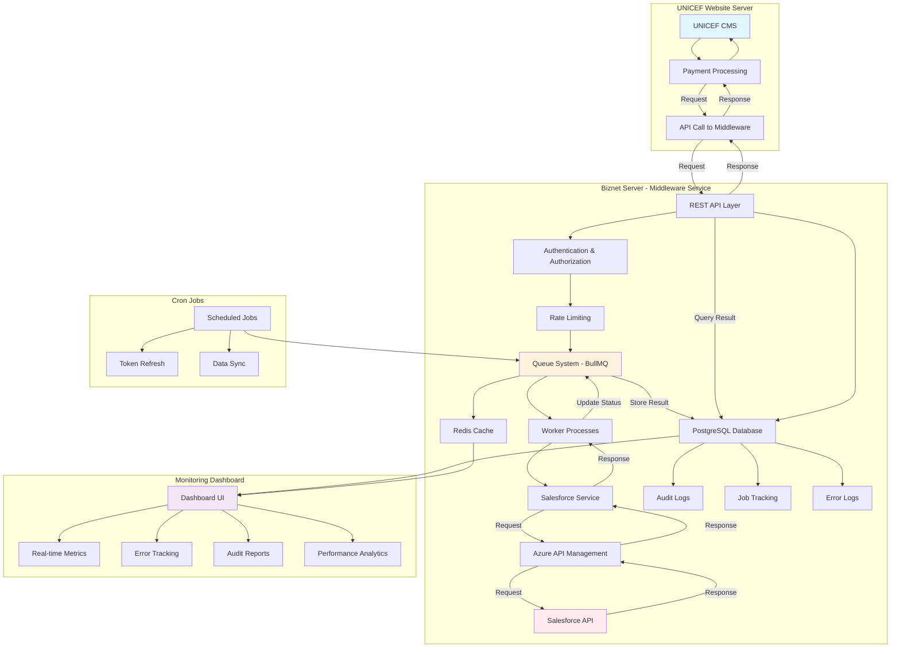
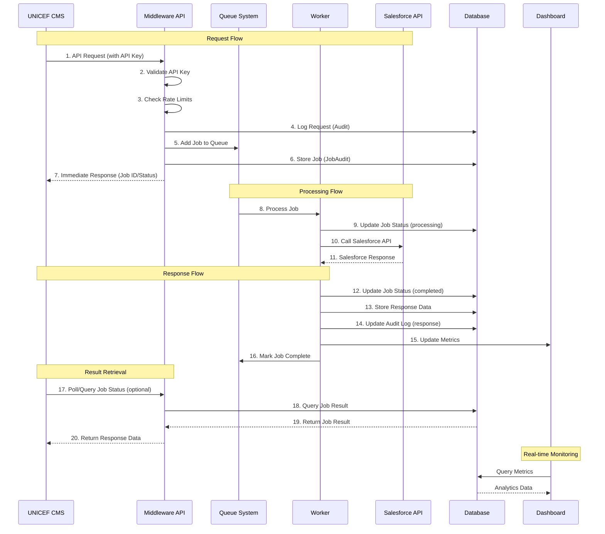
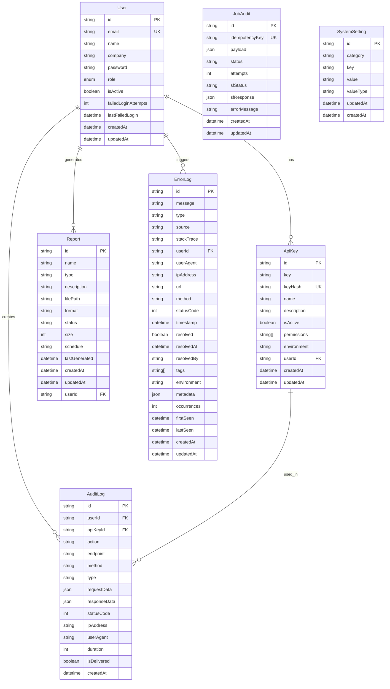

# Salesforce Middleware Migration Report
## UNICEF Website Server - PCI DSS Compliance & Microservice Implementation

**Project:** Salesforce Connection Migration & Microservice Architecture  
**Date:** November 2025  
**Status:** Completed

---

## Overall Goal

- Fix salesforce connection issue due to stricted PCI DSS system on the UNICEF Website Server.

- Implement microservice method to reduce UNICEF Website Server load, ease the system itself

- Handle huge loads to and from salesforce endpoint.

---

## Issue

- UNICEF Server having a connection issue to the sesapim.azure-api.net. 

- Using secondary IP was not working, showing the error OPENSSL SYS ERROR.

- IP Blocked from Microsoft side, so we cannot connect to the salesforce API.

### Root Cause Analysis

The primary issues identified were:

1. **Network Connectivity Issues**: The UNICEF server was unable to establish a reliable connection to the Azure API Management endpoint (`sesapim.azure-api.net`).

2. **IP Blocking**: Microsoft/Azure had blocked the UNICEF server's IP address, preventing any connection attempts.

3. **PCI DSS Compliance Constraints**: The strict PCI DSS compliance requirements on the UNICEF server limited network configurations and made troubleshooting connection issues more complex.

4. **SSL/TLS Errors**: OPENSSL SYS ERROR indicated underlying SSL/TLS handshake failures, likely due to certificate validation or network routing issues.

5. **System Load**: The existing monolithic architecture placed additional load on the UNICEF server, making it difficult to handle high-volume Salesforce transactions efficiently.

---

## Solution

- Make new systems, role as the REST API and worker/cron job for connecting to salesforce API, in a new server from Biznet Server. 

- Make Dashboard for monitoring and analyzing the process and report as well as log for that system.

- Move cronjob for salesforce transaction, from current UNICEF server to the new server in Biznet Server

- Make documentation for user guide

### Implementation Details

#### 1. Microservice Architecture

Created a dedicated middleware service hosted on Biznet Server that acts as an intermediary between the UNICEF Website Server and Salesforce API:

- **REST API Layer**: Provides clean, standardized endpoints for Salesforce operations
- **Queue System**: Implements BullMQ for asynchronous job processing and handling high-volume transactions
- **Worker Processes**: Dedicated workers process Salesforce API calls with retry mechanisms and error handling
- **Cron Job Management**: Centralized cron job execution for scheduled Salesforce transactions

#### 2. Dashboard & Monitoring System

Developed a comprehensive monitoring dashboard with the following capabilities:

- **Real-time Monitoring**: Live monitoring of API calls, job queues, and system health
- **Analytics & Reporting**: Detailed analytics on transaction volumes, success rates, and performance metrics
- **Error Tracking**: Comprehensive error logging and tracking with resolution workflows
- **Audit Logging**: Complete audit trail of all API calls and system operations
- **User Management**: Role-based access control (USER, ADMIN, SUPER_ADMIN)

#### 3. Migration Strategy

- **Cron Job Migration**: Successfully migrated all Salesforce-related cron jobs from UNICEF server to the new Biznet server
- **API Integration**: UNICEF Website Server now communicates with the middleware API instead of directly with Salesforce
- **Environment Separation**: Implemented multi-environment support (development, staging, production, production2)

#### 4. Documentation

Comprehensive documentation created including:

- API Documentation
- User Guide
- Architecture Documentation
- Deployment Guides
- Security & Error Handling Best Practices
- Monitoring & Troubleshooting Guides

---

## Diagram or Flowchart

### System Architecture Flow

### Request-Response Flow Diagram

---

## ERD (Entity Relationship Diagram)

### Database Schema Overview

**Core Entities:**

1. **User**: Manages user accounts with role-based access control (USER, ADMIN, SUPER_ADMIN)
2. **ApiKey**: Environment-specific API keys (development, staging, production) with SHA-256 hash validation
3. **AuditLog**: Comprehensive audit trail for all API calls with delivery tracking
4. **JobAudit**: Job queue tracking with status, attempts, and Salesforce responses
5. **Report**: Report generation and management system
6. **SystemSetting**: Runtime configuration settings including maintenance mode
7. **ErrorLog**: Error tracking with resolution workflow and occurrence tracking

**Key Relationships:**

- One User can have multiple API Keys (one per environment)
- One User can create multiple Audit Logs
- One API Key can be used in multiple Audit Logs
- One User can generate multiple Reports
- One User can trigger multiple Error Logs

---

## Tech Stack

### Backend (Middleware Service)

#### Core Framework & Runtime
- **Framework**: NestJS v11.0.1
- **Language**: TypeScript v5.9.3
- **Runtime**: Node.js 18+ (EA-NodeJS22 for cPanel/WHM)

#### Database & ORM
- **Database**: PostgreSQL v15 (production) / v16 (development)
- **ORM**: Prisma v6.18.0 (client) / v6.19.0 (CLI)

#### Queue & Cache
- **Queue System**: BullMQ v5.61.0
- **Cache**: Redis v7
- **Redis Client**: ioredis v5.8.2

#### HTTP Client & API
- **HTTP Client**: Axios v1.12.2
- **NestJS Axios**: @nestjs/axios v4.0.1

#### Security
- **Security Headers**: Helmet v8.1.0
- **Rate Limiting**: express-rate-limit v8.1.0
- **Password Hashing**: bcrypt v6.0.0
- **Authentication**: Passport v0.7.0, passport-jwt v4.0.1
- **JWT**: @nestjs/jwt v11.0.1

#### Monitoring & Observability
- **Metrics**: prom-client v15.1.3
- **Tracing**: @opentelemetry/api v1.9.0, @opentelemetry/sdk-node v0.207.0
- **Health Checks**: @nestjs/terminus v11.0.0

#### Validation & Utilities
- **Validation**: Zod v4.1.12, class-validator v0.14.2
- **Transformation**: class-transformer v0.5.1
- **Resilience**: cockatiel v3.2.1 (Circuit Breaker)

#### Logging
- **Logger**: pino v10.1.0
- **Pretty Logger**: pino-pretty v13.1.2

#### Scheduling
- **Cron Jobs**: @nestjs/schedule v6.0.1

#### Testing
- **Testing Framework**: Jest v30.2.0
- **NestJS Testing**: @nestjs/testing v11.1.7
- **HTTP Testing**: supertest v7.1.4
- **Alternative Testing**: vitest v3.2.4

### Frontend (Dashboard)

#### Core Framework
- **Framework**: React v19.2.0
- **Language**: TypeScript v5.9.3
- **Build Tool**: Vite v7.1.7

#### UI Components & Styling
- **UI Library**: Radix UI (Dialog, Dropdown, Select, Tabs, Toast, Tooltip, etc.)
- **Styling**: Tailwind CSS v3.4.18
- **Icons**: Lucide React v0.548.0

#### State Management & Data Fetching
- **State Management**: Zustand v5.0.8
- **Data Fetching**: TanStack Query (React Query) v5.90.5
- **Forms**: React Hook Form v7.65.0, @hookform/resolvers v5.2.2

#### Data Visualization
- **Charts**: ECharts v5.6.0, echarts-for-react v3.0.2
- **Alternative Charts**: Recharts v3.3.0

#### Tables & Data Display
- **Table Component**: @tanstack/react-table v8.21.3

#### Real-time Communication
- **WebSocket**: socket.io-client v4.8.1

#### HTTP Client
- **HTTP Client**: Axios v1.13.0

#### Routing
- **Router**: React Router DOM v7.9.4

#### Utilities
- **Date Handling**: date-fns v4.1.0
- **Validation**: Zod v4.1.12
- **Utilities**: clsx v2.1.1, tailwind-merge v3.3.1
- **Notifications**: Sonner v2.0.7

### Infrastructure & Deployment

#### Containerization
- **Docker**: Multi-container orchestration
- **Docker Compose**: Environment-specific configurations

#### Process Management
- **PM2**: Process manager for Node.js applications (production)

#### Web Server & Load Balancing
- **Nginx**: Reverse proxy and load balancer

#### Hosting Platform
- **cPanel/WHM**: Hosting platform support for production deployment

#### Monitoring Backend
- **Prometheus**: Metrics collection
- **Jaeger**: Distributed tracing (development)
- **OpenTelemetry**: Distributed tracing standards

#### Database Administration
- **Adminer**: Database administration tool (development)

### Architecture Patterns

- **Modular Architecture**: Clean separation of concerns
- **Dependency Injection**: NestJS built-in DI container
- **Repository Pattern**: Data access abstraction
- **Queue Pattern**: Asynchronous job processing
- **Guard Pattern**: Authentication and authorization
- **Circuit Breaker Pattern**: Resilience against failures

### Performance & Scalability

- **High Volume Processing**: Handles 450k+ jobs/day
- **Redis Cluster**: 3-node Redis cluster for high availability
- **PostgreSQL Optimization**: Indexed queries and optimized schema
- **Batch Processing**: Efficient batch operations for bulk transactions
- **Connection Pooling**: Optimized database connections
- **Rate Limiting**: Protection against API abuse

---

## Challenge

### Technical Challenges

1. **Network Connectivity & IP Blocking**

   The primary challenge emerged when the UNICEF server's IP address was blocked by Microsoft/Azure, completely preventing any direct connection attempts to the Salesforce API endpoint at `sesapim.azure-api.net`. This blocking occurred despite attempts to use secondary IP addresses, which resulted in OPENSSL SYS ERROR messages indicating SSL/TLS handshake failures. The root cause was identified as IP-based blocking from Microsoft's side, making it impossible to establish connections from the UNICEF server infrastructure. To resolve this, we deployed the middleware service on a new Biznet Server with a different IP range, effectively bypassing the IP block while maintaining all functionality. This solution required a complete architecture redesign and server migration, but it successfully restored connectivity to Salesforce while also providing the added benefit of offloading processing from the UNICEF server.

2. **PCI DSS Compliance Constraints**

   The strict PCI DSS compliance requirements on the UNICEF Website Server created significant limitations on network configurations and troubleshooting capabilities. These constraints made it difficult to diagnose and resolve connection issues, as many standard troubleshooting methods were restricted or required extensive compliance reviews. By separating the Salesforce integration into a dedicated middleware service hosted on Biznet Server, we effectively reduced the PCI DSS scope on the main UNICEF server while maintaining all required functionality. This architectural change not only resolved the immediate connectivity issues but also improved the overall compliance posture by isolating payment-related processing in a separate, more controlled environment.

3. **High Volume Transaction Handling**

   The system needed to handle over 450,000 jobs per day with reliable processing and minimal latency, which posed significant scalability challenges. The previous monolithic architecture on the UNICEF server was not designed to handle such high volumes efficiently. To address this, we implemented a BullMQ queue system with Redis as the backing store, allowing for asynchronous job processing with multiple worker processes. The queue system enabled batch processing capabilities, job prioritization, and horizontal scaling of workers. This solution achieved scalable and reliable high-volume processing while maintaining low latency and high throughput, ensuring that transaction backlogs do not accumulate even during peak usage periods.

4. **SSL/TLS Certificate Issues**

   The OPENSSL SYS ERROR messages indicated underlying SSL/TLS handshake failures that were preventing secure connections to the Salesforce API. These errors were likely caused by certificate validation issues, network routing problems, or compatibility issues between the UNICEF server's SSL configuration and the Azure API Management endpoint. By implementing proper certificate management in the middleware service with configurable SSL validation, we were able to resolve the connection issues while maintaining security standards. The middleware service now handles SSL/TLS negotiations properly, with support for custom certificate configurations and proper validation, ensuring secure connections to Salesforce while avoiding the previous handshake failures.

5. **Multi-Environment Management**

   Managing multiple environments (development, staging, production, and production2) with different configurations, API endpoints, and credentials created operational complexity. Each environment required separate API keys, different Salesforce endpoints, and environment-specific configurations. To streamline this, we implemented environment-specific configuration management with separate API keys for each environment per user, environment detection based on API keys, and automated deployment scripts for each environment. This solution streamlined deployment and testing processes while ensuring that configurations are properly isolated between environments, reducing the risk of cross-environment contamination and making it easier to manage multiple deployment targets.

6. **Error Handling & Resilience**

   Ensuring reliable processing despite network issues, API failures, and transient errors was critical for maintaining system availability. The previous system lacked comprehensive error handling, making it difficult to recover from failures or understand what went wrong. We implemented robust retry mechanisms with exponential backoff, circuit breakers to prevent cascading failures, comprehensive error logging with detailed stack traces, and job status tracking throughout the entire lifecycle. This solution improved system reliability significantly, as transient failures are now automatically retried, and persistent issues are quickly identified and isolated. The comprehensive error logging also makes troubleshooting much easier, as we can quickly identify the root cause of any issues.

7. **Real-time Monitoring & Observability**

   The need for comprehensive monitoring, logging, and analytics without impacting system performance was essential for operational visibility. The previous system lacked real-time monitoring capabilities, making it difficult to understand system health, identify bottlenecks, or track performance metrics. We built a comprehensive monitoring dashboard that provides real-time metrics on API calls, job queues, system health, and performance indicators. The dashboard includes audit logging for all API calls, error tracking with resolution workflows, and performance analytics with historical data. This solution provides improved visibility into system operations without impacting performance, as all monitoring is done asynchronously with minimal overhead. The dashboard enables faster issue resolution and proactive system management.

8. **Migration from Monolithic to Microservice**

   Migrating cron jobs and API calls from the UNICEF server to the new middleware service without downtime was a critical operational challenge. The migration needed to be seamless to avoid disrupting ongoing operations and transactions. We implemented a phased migration approach that included comprehensive testing in staging environments, gradual rollout with feature flags, and detailed rollback plans for each phase. The migration process involved updating the UNICEF CMS to point to the new middleware API endpoints, migrating all cron jobs to the new server, and verifying that all functionality worked correctly in the new architecture. This solution resulted in a successful migration with minimal disruption, as we were able to test thoroughly before going live and had rollback procedures in place if any issues were encountered.

9. **Security & Authentication**

   Implementing secure API key management and authentication across multiple environments while maintaining ease of use was a complex security challenge. The system needed to support multiple users, multiple environments, and different permission levels while ensuring that API keys are secure and properly validated. We implemented environment-specific API keys with SHA-256 hash validation for fast lookup and security, JWT authentication for user sessions, and role-based access control (USER, ADMIN, SUPER_ADMIN) for fine-grained permissions. Each user can have separate API keys for each environment, and API keys are stored securely with hashed validation. This solution enhanced security and access control while maintaining usability, as users can easily manage their API keys through the dashboard, and the system automatically validates keys and permissions for each request.

10. **Documentation & Knowledge Transfer**

    Creating comprehensive documentation for users, developers, and the operations team was essential for long-term maintainability and knowledge transfer. The previous system lacked adequate documentation, making it difficult for new team members to understand the system or for existing team members to troubleshoot issues. We developed extensive documentation including API documentation with all endpoints and examples, user guides for dashboard usage and common tasks, architecture documentation explaining system design and components, deployment guides for all environments, security and error handling best practices, and monitoring and troubleshooting guides. This solution improved maintainability and knowledge transfer significantly, as team members can now quickly understand the system, troubleshoot issues, and onboard new members. The documentation is kept up-to-date with system changes and serves as a valuable resource for all stakeholders.

### Operational Challenges

Coordinating the migration from the UNICEF server to Biznet server required careful planning and coordination between multiple teams and stakeholders. We ensured all scheduled cron jobs were properly migrated and tested in the new environment before going live, which involved mapping all existing cron jobs, verifying their functionality, and testing them thoroughly in staging. Updating the UNICEF CMS to use the new middleware API endpoints required code changes and careful testing to ensure compatibility. We established comprehensive monitoring and alerting for the new infrastructure to ensure we can quickly identify and respond to any issues. Performance optimization was an ongoing effort, as we tuned the system for high-volume processing by optimizing database queries, configuring Redis clusters, and tuning worker processes. Finally, we implemented backup and recovery procedures to ensure data safety and system resilience, including automated database backups, disaster recovery plans, and regular backup testing.

---

## Next Plan

- Monitoring the salesforce every week

- Fix immediately if there is an error

- Optimize the system if needed for improving the system

- Daily check of new server, and check the salesforce response on UNICEF CMS.

### Detailed Next Steps

#### 1. Ongoing Monitoring & Maintenance

**Weekly Tasks:**
- Review Salesforce API connection health and response times
- Analyze error logs and identify patterns
- Check queue processing metrics and job success rates
- Review performance metrics and identify bottlenecks
- Verify audit logs for compliance and security

**Daily Tasks:**
- Check new server health and resource utilization
- Monitor Salesforce API response status on UNICEF CMS
- Review error logs for critical issues
- Verify cron job execution and status
- Check database performance and connection pools

#### 2. Error Resolution & Support

**Immediate Response:**
- Implement automated alerting for critical errors
- Establish on-call rotation for 24/7 support
- Create runbooks for common error scenarios
- Set up automated error notification system
- Implement automatic retry mechanisms for transient failures

**Error Resolution Process:**
- Categorize errors by severity (critical, high, medium, low)
- Prioritize resolution based on impact and urgency
- Document resolution steps and lessons learned
- Update error handling procedures based on findings

#### 3. System Optimization

**Performance Optimization:**
- Monitor and optimize database queries and indexes
- Review and optimize queue processing rates
- Implement caching strategies where applicable
- Optimize API response times
- Review and optimize resource utilization (CPU, memory, network)

**Scalability Improvements:**
- Plan for horizontal scaling if volume increases
- Optimize Redis cluster configuration
- Review and optimize PostgreSQL configuration
- Implement load balancing strategies
- Plan for multi-region deployment if needed

#### 4. Feature Enhancements

**Dashboard Improvements:**
- Add more detailed analytics and reporting
- Implement custom alerting rules
- Add export capabilities for reports
- Enhance real-time monitoring features
- Add predictive analytics for capacity planning

**API Enhancements:**
- Add new Salesforce API endpoints as needed
- Implement batch processing optimizations
- Add webhook support for real-time notifications
- Enhance error handling and retry mechanisms
- Add API versioning support

#### 5. Security & Compliance

**Security Hardening:**
- Regular security audits and vulnerability assessments
- Implement security best practices
- Review and update API key management
- Enhance authentication and authorization
- Implement data encryption at rest and in transit

**Compliance:**
- Ensure PCI DSS compliance is maintained
- Regular compliance audits
- Update documentation for compliance requirements
- Implement audit logging enhancements
- Review and update data retention policies

#### 6. Documentation & Training

**Documentation Updates:**
- Keep documentation up to date with system changes
- Add troubleshooting guides for common issues
- Update API documentation with new endpoints
- Create video tutorials for dashboard usage
- Maintain architecture documentation

**Training:**
- Provide training for operations team
- Create knowledge base articles
- Conduct regular knowledge sharing sessions
- Document lessons learned and best practices

#### 7. Disaster Recovery & Backup

**Backup Strategy:**
- Implement automated database backups
- Regular backup testing and verification
- Document backup and recovery procedures
- Implement disaster recovery plan
- Test disaster recovery procedures regularly

#### 8. Future Improvements

**Technology Upgrades:**
- Plan for framework and dependency updates
- Evaluate new technologies for performance improvements
- Consider migrating to newer infrastructure platforms
- Evaluate cloud-native solutions

**Architecture Evolution:**
- Plan for microservice further decomposition if needed
- Evaluate event-driven architecture patterns
- Consider implementing API gateway
- Plan for multi-cloud deployment if needed

---

## Conclusion

The Salesforce middleware migration project successfully addressed the connection issues between the UNICEF Website Server and Salesforce API by implementing a microservice architecture on Biznet Server. The solution provides:

- **Reliability**: Robust error handling, retry mechanisms, and monitoring
- **Scalability**: Handles 450k+ jobs/day with room for growth
- **Security**: Environment-specific API keys, authentication, and audit logging
- **Observability**: Comprehensive monitoring dashboard and logging
- **Maintainability**: Well-documented, modular architecture

The migration has successfully reduced the load on the UNICEF server, improved system reliability, and provided a foundation for future enhancements and scaling.

---

**Document Version:** 1.0  
**Last Updated:** 15 November 2025  
**Author:** Development Team  
**Status:** Completed

